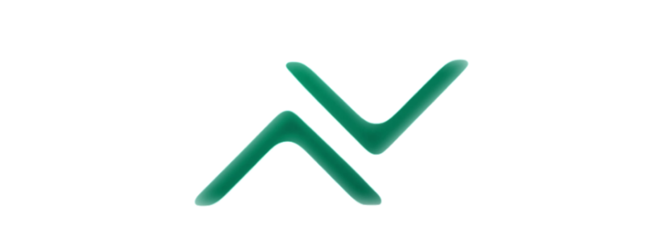
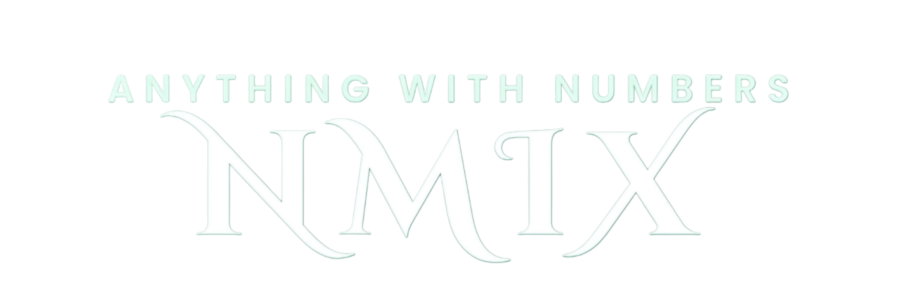

# NMIX

  
  

  ## 🌐 Live Demo & Access
  
  **Try NMIX directly in your browser:**
  
  ### 🚀 [https://lxzrvi.github.io/NMIX/](https://lxzrvi.github.io/NMIX/)

  

    
    
    
  

---

### 📌 About
**NMIX** is a modern, framework-free web application built using pure HTML, CSS, and JavaScript. It brings basic calculations, time tools, counters, and UI personalizations together into one fast and minimal interface.

---

### ✨ Core Features

* 🧮 **Calculator:** Custom keypad with basic arithmetic, percentages, backspace, and sign switching.
* ⏰ **Clock Tools:** Real-time clock, stopwatch, countdown timer, and full-screen display.
* 🔢 **Counters:** Fast counting with tap/hold controls and a random number generator.
* 🎨 **Personalization:** Light/Dark modes, 5 color themes (Emerald, Ocean, Violet, Sunset, Rose), and custom Google Fonts.

---

### 👨‍💻 Contributor

**Alex Ravi** — Web Development Learner
* **Tech Stack:** HTML5, CSS3, JavaScript (vanilla)

---

  © Alex Ravi • Made with ❤️ using JavaScript

